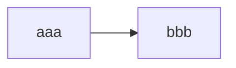

# 設計概要 というかメモ

## クラスなど

### いつも使うよ

- Logger
  - デバッグ用のUtilだよ
  - 思いつきの機能を監視したりするよ
- GameManager
  - ゲームの基本的な統括をするよ
  - ターン進行やゲームの状況(State)を管理するよ
- PlayerManager
  - Player クラスを管理するよ
  - 状態が複雑化する場合、それぞれの状況別になにかクラスやロジックを挟むよ
  - Player クラスはなるべく独立してるよ
- Player
  - Player の情報を管理するよ
  - 実装エラーハンドリング以外のロジックは極力持たせないよ(大事)
- UIManager
  - アニメーションとかUIの発生、完了を管理するよ

## 麻雀特有のやつ

- 場マネージャー GameRoundManager
  - 場風
  - 局数
  - 連荘
  - 親
  - ドラ表示牌
  - 裏ドラ
  - 積み棒
  - 進行状況
    - 準備
    - 開始
    - 手番プレイヤー
    - 終了
  - プレイヤー
- 点数計算 ScoreCalculator
  - 点数計算を行うクラス
- 牌マネージャー TilesManager
  - 標準的なゲームにおいて、136枚あるよ
  - シャッフル機能などを持たせるよ
  - ネット対戦向けであれば公開情報以外クライアントに持たせないよ
- 牌クラス Tile
  - 牌の情報を表現するよ
  - 種類 suit
  - 赤ドラ isRed
  - 鳴き状況 fuuro
    - 鳴いた人
    - 持っていた人
- enum TileSuit
- enum Fonpai
  - Ton
  - Nan
  - Sha
  - Pei
- enum Sangenpai
  - Haku
  - Hatsu
  - Chun
- 手牌マネージャー HandManager
  - ツモ牌を整理するよ
  - ツモる
  - 切る
- 手牌クラス Hand
  - 手牌の並びを

